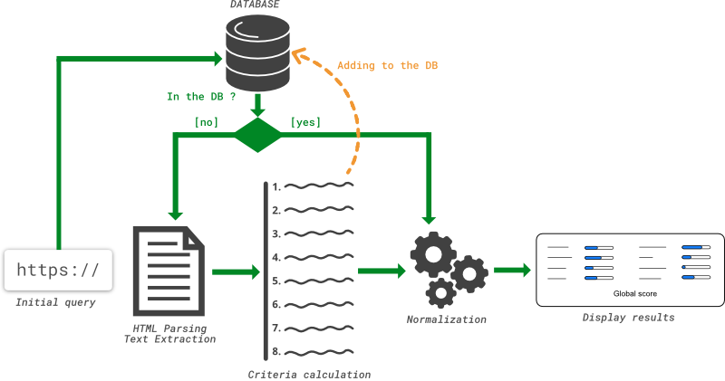

# An Information Nutritional Label for Online Documents

## General working

* This project is based on the **Flask** framework and coded in Python.
* This schema presents the main components of our app.
* The “root” file is `app.py`. 
* All the libraries used are in `requirements.txt`.



1. The user enters the url of the article he wants to be analysed.
We call the class `ScoreCalculation` which checks if the scores have already been computed and stored in the database.
2. If it is the case, the class `ScoreNormalization` returns a normalized score for each criterion based on the min and max score observed.
3. If it is not the case, 
3.1 We extract the text from the HTML of the article with the library [`newspaper`](https://github.com/codelucas/newspaper/)
3.2 We compute each score separately with the dedicated classes in `/criterias_calculation/` and we normalize the scores.
4. The results are displayed to the user.

## Criteria calculation

### Emotion

To compute the emotion score, we use the file `AFFIN.py` (from this [`library of emotional word`](http://www2.imm.dtu.dk/pubdb/views/publication_details.php?id=6010)) , from Finn Årup Nielsen. It contains a list of 2477 emotional words and valuation (ex : abusive  -3, proud  2).  

First, the text of the article is tokenized. Then, for each sentence, we sum the positive and negative valuation of the emotional words (words present in the file) and we divide by the number of words in the sentence. After this treatment, we sum the values of all the sentences of the article and we divide them by the number of sentences.  

With these values, we compute the ratio of positive and negative emotion in the text and we return the sum of the positive score and the absolute value of the negative score.
This result is normalized.

### Readability :

There are many formulas to measure the readability of a text. Most of them use measures like the number of words in a sentence, the number of complicated words, the number of syllables in a word, etc, and return the American grade or the age necessary to understand the analyzed text.  

We use the library [`readability`](https://github.com/andreasvc/readability/) from Andreas van Cranenburgh, that already implements different readability formulas, and text processing (tokenization, etc.).
 
First, we retrieved the text of the article and used the different formulas to get all the readability scores. To see more informations about the formulas, you can visit this [website](https://www.webpagefx.com/tools/read-able/). If there is less than 100 words in our text, the score of Coleman-Liau formula and the score of the Gunning Fog Index formula aren't used. If there is less than 30 sentences, the score of the SMOG index formula isn’t used.  
Unlike the others criterias, the normalization of the readability score isn’t made at the end of the treatment, but at this step. All the scores of the different readability formulas are compared to the minimal and maximal values present in the file `readability_scale.txt`. If one score is inferior or superior than the values in the file, the file is update.  

Then, with the table of normalized scores, we calculate a median. It is this value which is returned as the score of the readability criterion.  

We also implemented an agreement rate, using Krippendorff's alpha, to see if the different formulas used returned very different values or not. We use the [code of Thomas Grill](https://github.com/grrrr/krippendorff-alpha/blob/master/krippendorff_alpha.py).

To compute this value, we create a table of categories around the median with a range of twenty (for example, if the median is 64, the table will be [0, 14] [14, 34] [34, 54] [54, 74] [74, 94] [94, 100]). Then we use the repartition of the score of the different formulas (already found to calculate the median) to compute the alpha.


### Factuality and Opinion :

To compute a score for Factuality and Opinion, we count the number of sentences that represent respectively a fact or a personal opinion and we divide that number by the total number of sentences in the article. This gives us a value between 0 and 1, hence we can get a percentage.

To classify sentences as facts or opinion, I based my work on the method of the neural network found in the classifier made by [“matatusko”](https://github.com/matatusko/opinion-or-fact-sentence-classifier/) as it had 92% accuracy.

The neural network is a Multi-layer Perceptron classifier, using LBFGS gradient descent. This neural network has 500 neurons in the first hidden layer and 5 neurons in the second hidden layer. The activation function used is the rectified linear unit function (“`relu`”).

The datasets to train the neural networks come from Wikipedia for factual sentences and from [“Opinosis”](http://kavita-ganesan.com/opinosis/) for opinion sentences. There was in total 11,000 sentences in the dataset.

The features used to classify a sentence are fine-grained part-of-speech tags extracted with [`spaCy`](https://spacy.io/). These features are computed for each sentences and the vectors resulting from this computation are the data used by the neural network.

Finally, to compute the final score, the text of the given article is split in sentences that we classify with the neural network and that we count to get a ratio of fact sentences and opinion sentences.

### Trust : 

To compute the trust score, we use an API provided by the website [mywot.com](https://www.mywot.com/) which returns a trust score of the article domain. The API returns 2 informations :

* **reputation** of the website. [0, 100]
* **confidence** of the score provided. [0, 100] If the confidence score is less than 10, we should not display the results.

```
API_KEY = c6954eeb25d45fe8258ab87b121fe28804e93fcf
```

### Controversy :

In order to calculate the Controversy Score for an given article, we count the number of controversial issues in the text. We based our detection system on the Wikipedia Article [List_of_controversial_issues](https://en.wikipedia.org/wiki/Wikipedia:List_of_controversial_issues). For each issue referenced in the wiki article, we also take in account the synonyms and other appellations of the issues based on the anchor text label in all of the Wikipedia database.

The score returned is the number of controversial issues detected divided by the number of words in the text.

### Technicality :

This criterion allows to know the rate of technicality of an article. For that, we will use the library NLTK [1] to tag all the words of the text (adjective = JJ, name = NN, etc.). Then, we use the RE library to match, from tags, with a regular expression defined in the article by John S. Justeson and Slava M. Katz [2] which identifies the "Terminological noun phrases (NPs)". 

These, in case of repetition in the article, are very likely to correspond to a domain-specific vocabulary. We thus recover all the NPs of the article and count those which are identical. We delete those that are only present once. To obtain the technical score, the ratio of the number of NPs on the number of words in the article is calculated.

[1] : Bird, Steven, Edward Loper and Ewan Klein (2009).
Natural Language Processing with Python.  O'Reilly Media Inc.

[2] : John  S.  Justeson  and  Slava  M.  Katz  (1995).  Technical  terminology:  some  linguistic properties  and  an  algorithm  for  identification  in  text.  Natural  Language  Engineering,  1, pp  9-­27  doi:10.1017/S1351324900000048

### Topicality :

This criterion allows to know the rate of the top searches among the keywords of the article on the last month. For this, we retrieve the keywords of the article. Then, using pytrends [3], we connect to Google with the TrendReq method. 

We create payload and capture API tokens with the build_payload method, and finally we retrieve the number of times that each keyword has been in top search on the last month. The score is obtained by summing all of these. To manipulate this data, we use pandas.

[3] : https://github.com/GeneralMills/pytrends

